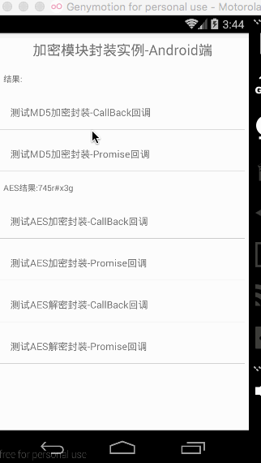

###当前项目封装了常用的加密方式例如:MD5,AES,DES加密,供React Native进行使用,不过当前项目适配Android平台。
<a href="http://www.lcode.org">www.lcode.org</a>主要讲解了React Native开发，由基础环境搭建配置入门，基础，进阶相关讲解。
### Installation
```bash
npm install react-native-encryption-library --save
```
* In `android/setting.gradle`

```gradle
...
include ':react-native-encryption-library'
project(':react-native-encryption-library').projectDir = new File(rootProject.projectDir, '../node_modules/react-native-encryption-library/android')
```

* In `android/app/build.gradle`

```gradle
...
dependencies {
    ...
    compile project(':react-native-encryption-library')
}
```

* register module (in MainActivity.java)

On newer versions of React Native (0.18+):
```java
import com.chinaztt.encapsulation.EncryptionReactPackager;;  // <--- import

public class MainActivity extends ReactActivity {
  ......
    @Override
    protected List<ReactPackage> getPackages() {
      return Arrays.<ReactPackage>asList(
         new EncryptionReactPackager(), // <------ add here
        new MainReactPackage());
    }
}
```

On older versions of React Native:
```java
import com.chinaztt.encapsulation.EncryptionReactPackager;;  // <--- import

public class MainActivity extends Activity implements DefaultHardwareBackBtnHandler {
  ......

  @Override
  protected void onCreate(Bundle savedInstanceState) {
    super.onCreate(savedInstanceState);
    mReactRootView = new ReactRootView(this);

    mReactInstanceManager = ReactInstanceManager.builder()
      .setApplication(getApplication())
      .setBundleAssetName("index.android.bundle")
      .setJSMainModuleName("index.android")
      .addPackage(new MainReactPackage())
      .addPackage( new EncryptionReactPackager())              // <------ add here
      .setUseDeveloperSupport(BuildConfig.DEBUG)
      .setInitialLifecycleState(LifecycleState.RESUMED)
      .build();

    mReactRootView.startReactApplication(mReactInstanceManager, "ExampleRN", null);

    setContentView(mReactRootView);
  }

  ......

}
```

### Usage

First, require it from your app's JavaScript files with:
```bash
import {NativeModules} from 'react-native';
var EncryptionModule=NativeModules.EncryptionModule
```


### Example

```js
import React, { Component } from 'react';
import {
  AppRegistry,
  StyleSheet,
  Text,
  View,
  TouchableHighlight
} from 'react-native';
import {NativeModules} from 'react-native';
var EncryptionModule=NativeModules.EncryptionModule

//待加密的信息
var PASSWORD='745r#x3g';
var KEY='wIEuw3kAGwVNl7BW';  //16位AES加密私钥

class CustomButton extends React.Component {
  render() {
    return (
      <TouchableHighlight
        style={styles.button}
        underlayColor="#a5a5a5"
        onPress={this.props.onPress}>
        <Text style={styles.buttonText}>{this.props.text}</Text>
      </TouchableHighlight>
    );
  }
}
class react_native_encryption_library extends Component {
  constructor(props){
     super(props);
     this.state={
        result:'',
        AES_Result:'',
     }
  }
  async _MD5ByPromise(){
     try{
        var result=await EncryptionModule.MD5ByPromise(PASSWORD);
        this.setState({result:'Promise:'+result});
     }catch(e){
        this.setState({result:'MD5加密失败-通过Promise回调'}); 
     }
  }
  async _AESEncryptByPromise(){
     try{
        var result=await EncryptionModule.AESEncryptByPromise(PASSWORD,KEY);
        this.setState({AES_Result:result});
     }catch(e){
        this.setState({AES_Result:'AES加密失败-通过Promise回调'}); 
     }
  }
  
  async _AESDecryptByPromise(){
     try{
        var result=await EncryptionModule.AESDecryptByPromise(this.state.AES_Result,KEY);
        this.setState({AES_Result:result});
     }catch(e){
        this.setState({AES_Result:'AES解密失败-通过Promise回调'}); 
     }
  }
  render() {
    return (
      <View style={styles.container}>
        <Text style={styles.welcome}>
           加密模块封装实例-Android端
        </Text>
        <Text style={{margin:10,fontSize:12}}>
           结果:{this.state.result}
        </Text>
        <CustomButton
           text="测试MD5加密封装-CallBack回调"
           onPress={()=>EncryptionModule.MD5ByCallBack(PASSWORD,(msg)=>{
               this.setState({result:'CallBack:'+msg});
          },(error)=>{
               this.setState({result:'MD5加密失败-通过Callback回调'});   
          })}
        />
        <CustomButton
           text="测试MD5加密封装-Promise回调"
           onPress={()=>this._MD5ByPromise()}
        />
         <Text style={{margin:10,fontSize:12}}>
           AES结果:{this.state.AES_Result}
        </Text>
        <CustomButton
           text="测试AES加密封装-CallBack回调"
           onPress={()=>EncryptionModule.AESEncryptByCallBack(PASSWORD,KEY,(msg)=>{
               this.setState({AES_Result:msg});
          },(error)=>{
               this.setState({AES_Result:'AES加密失败-通过Callback回调'});   
          })}
        />
        <CustomButton
           text="测试AES加密封装-Promise回调"
           onPress={()=>this._AESEncryptByPromise()}
        />
        <CustomButton
           text="测试AES解密封装-CallBack回调"
           onPress={()=>EncryptionModule.AESDecryptByCallBack(this.state.AES_Result,KEY,(msg)=>{
               this.setState({AES_Result:msg});
          },(error)=>{
               this.setState({AES_Result:'AES解密失败-通过Callback回调'});   
          })}
        />
        <CustomButton
           text="测试AES解密封装-Promise回调"
           onPress={()=>this._AESDecryptByPromise()}
        />
      </View>
    );
  }
}
const styles = StyleSheet.create({
  welcome: {
    fontSize: 20,
    textAlign: 'center',
    margin: 10,
  },
  button: {
    margin:5,
    backgroundColor: 'white',
    padding: 15,
    borderBottomWidth: StyleSheet.hairlineWidth,
    borderBottomColor: '#cdcdcd',
  },
});
AppRegistry.registerComponent('encryption_library', () => react_native_encryption_library);
```
###Screenshot


